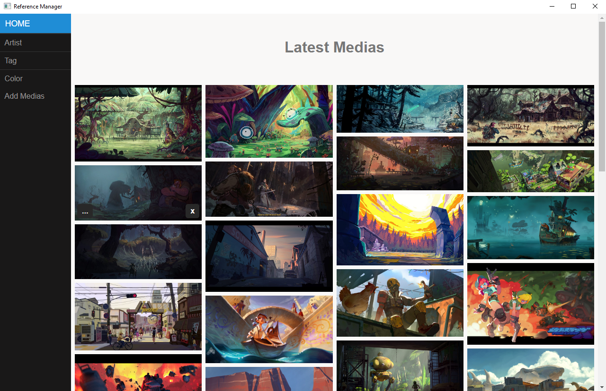

# References Manager
Web-Based application to organize and display pictures create by and for digital artist





Features
--------

- Display pictures
- Searching functionality by Artist name, Tags and Color
- Automatic detection of color when you import a picture
- Link to other application ([Krita](https://krita.org/en/), [PureRef](https://www.pureref.com/), etc..) 

Dependencies
------------

### Python 

|        | Version |
| ------ | ------- |
| Python | \>= 3.6 |

### Packages :

| Python Packages      | 
| -------------------- | 
| pyqt5                |
| PyQtWebEngine        |
| Flask                |
| pillow               |
| requests             |
| bs4                  |

Installation
------------

1. Install [python](https://www.python.org/) version superior or equal to 3.6
2. Clone this repository or download the zip file and extract
   ```
    > git clone https://github.com/fabiencollet/references-manager.git
   ```
3. In a terminal navigate to the folder of the application like :
   - Windows :
   ```
    > cd C:\Users\<username>\Documents\references-manager
   ```
   - OSx and linux:
    ```
    > cd /user/<username>/Documents/references-manager
   ```
4. Install python dependencies with the command
   ```
    > pip install .
   ```
5. It's Done !!

Launch App
----------

### Desktop mode
1. Open the file app.py

### Web mode
1. Open the file run_server.bat
2. Open the file open.bat